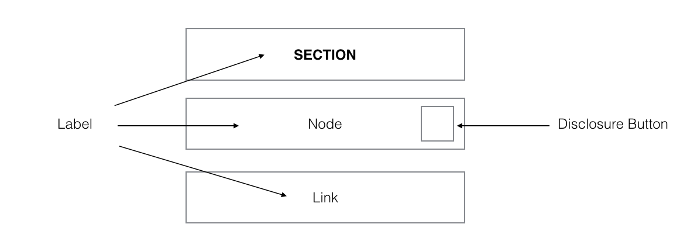

# myToys Technical Test

We have created a small technical test for you to showcase how you work.
Your task will be to create a small iOS Application that should open links in a UIWebview and use a hierarchy navigation that opens if you touch on a menu button.

## Challenges

- Implement a SingleViewApplication with a UIWebview. On Startup the app should load https://www.mytoys.de.
- Implement a NavigationBar with a left button "Menu" and a right button "Close"
- Touching on the menu button should display the menu in a NavigationController holding TableViewController modally.
- The menu entries must be fetched via an API Rest Call.
	- The API Endpoint for the navigation entries is ```https://mytoysiostestcase1.herokuapp.com/api/navigation ``` and requires the following API-Key ```hz7JPdKK069Ui1TRxxd1k8BQcocSVDkj219DVzzD``` as ```x-api-key``` request header field.
	- You can preview the response in the terminal if you use curl with the header option to set the x-api-key ``` curl -H 'x-api-key:hz7JPdKK069Ui1TRxxd1k8BQcocSVDkj219DVzzD'  https://mytoysiostestcase1.herokuapp.com/api/navigation ```
	- The JSON structure of the response:
```json
{
	"navigationEntries": [{
		"type": "section",
		"label": "Sortiment",
		"children": [{
			"type": "node",
			"label": "Alter",
			"children": [{
				"type": "node",
				"label": "Baby & Kleinkind",
				"children": [{
					"type": "link",
					"label": "0-6 Monate",
					"url": "http:\/\/www.mytoys.de\/0-6-months\/"
				}, {
					"type": "link",
					"label": "7-12 Monate",
					"url": "http:\/\/www.mytoys.de\/7-12-months\/"
				}]
			}]
		}]
	}]
}
```

As you can see there are three types of **navigationEntries**:

- **section**: repesented in JSON as```"type": "section" ```
- **node**: repesented in JSON as ```"type": "node" ```
- **link**: repesented in JSON as ```"type": "link" ```



Section and nodes can have children. Children is an array that can contain **section**, **node** and **link** entries.

Sections do not have any select interaction, they are only used as visual seperator (and should not be clickable).

**link** has only an URL and a label, no children. All URLs are absolute.

Nodes and Links have actions that are described below:

## Interaction


- Node Interaction:
If you touch inside a node a new TableViewController must be pushed on the navigationController. The entries of the cells are the children of the selected node. The title of the current view is the label of the selected node. Moreover the left button changes to a back button.

	- Back button Interaction: If the user presses the back button the current TableViewController needs to be popped.


- Link Interaction:

If you touch inside a link the modalViewController should disappear and the WebView should load with the url of the selected link.

- Close Button:
	The modalViewController could be closed by touching inside the right close button.


Please have a look at the following gif for a better understand of the functionality:


 to see how the interaction looks like or download the [myToys App](https://itunes.apple.com/de/app/mytoys-kindermode-und-spielzeug/id1133168701?mt=8) from the German App store.

Interaction should look like the current iOS Version of the MyToys App available on the German App Store


### Hint:
Feel free to use a framework for Networking and JSON operation, but if so please use cocoapods to include the dependency in your project.
You do not need to style the app in the colors of MyToys. Focus on the interaction and functionality.

## Requirements

- Your code must be in Swift 2.x
- Minimum supported OS must be iOS9
- Use Xcode 7.3.1
- Write tests
- It must compile and run in the iPhone Simulator
- Write a paragraph or two on how you approached the work and what you considered during development
- We like git so feel free to send us the link to your repository

## Additional Information

### Hierarchy Navigation:
https://developer.apple.com/ios/human-interface-guidelines/interaction/navigation/


We understand that you’ve probably got a full-time job and a personal life so doing the above test will definitely finished in a couple of hours.

# Bonus

- Highlight the last selected link in the menu.
- Offline functionality. Perhabs for a better user experience it will make sense to store the navigation entries.

If you have any questions, email us and we can add it to this readme.

Good luck!
